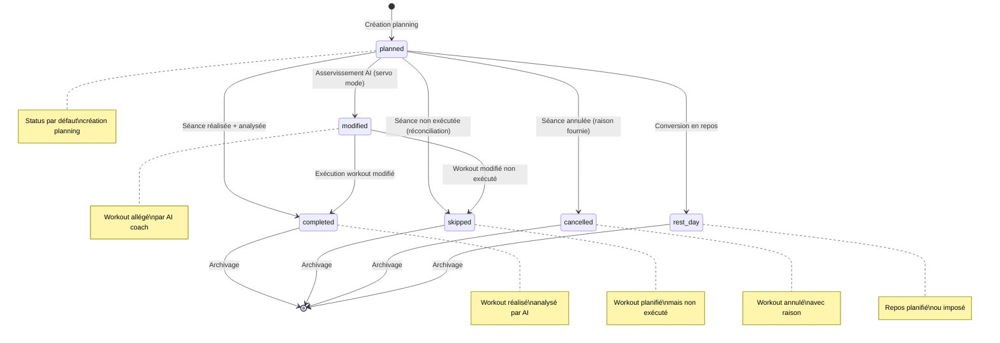
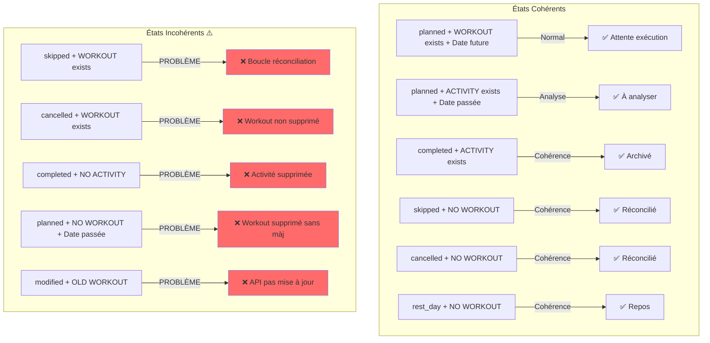

# PHASE 1 - AUDIT COMPLET ET CARTOGRAPHIE WORKFLOW

**Date**: 2025-12-21
**Projet**: cyclisme-training-logs
**Objectif**: Audit complet du système asservissement + détection des problèmes production

---

## TABLE DES MATIÈRES

1. [Inventaire Modules Workflow](#1-inventaire-modules-workflow)
2. [Diagramme États et Transitions](#2-diagramme-états-et-transitions)
3. [Documentation Flux Workflows](#3-documentation-flux-workflows)
4. [Matrice Décisions États](#4-matrice-décisions-états)
5. [Problèmes Critiques Identifiés](#5-problèmes-critiques-identifiés)
6. [Dépendances et Architecture](#6-dépendances-et-architecture)
7. [Recommandations Prioritaires](#7-recommandations-prioritaires)

---

## 1. INVENTAIRE MODULES WORKFLOW

### 1.1 Modules Core

#### **workflow_coach.py** (2360 lignes)
**Responsabilité**: Orchestrateur principal du système d'analyse et d'asservissement

**Entrées**:
- CLI arguments: `--skip-feedback`, `--skip-git`, `--activity-id`, `--week-id`, `--servo-mode`, `--reconcile`
- Fichiers: `.workflow_state.json`, `data/week_planning/week_planning_*.json`, `logs/workouts-history.md`
- API: Intervals.icu (activities, events)

**Sorties**:
- Fichiers: `logs/workouts-history.md` (analyses), `data/week_planning/week_planning_*.json` (màj planning)
- API: Intervals.icu (DELETE workout, POST nouveau workout)
- Git commits (optionnel)

**États Gérés**:
- `unanalyzed_activities`: Liste activités non analysées
- `skipped_sessions`: Séances sautées détectées
- `planning`: Planning semaine courante
- `reconciliation`: Résultat réconciliation

**Méthodes Clés**:
- `run()` (2175-2260): Orchestrateur principal 7 étapes
- `step_1b_detect_all_gaps()` (766-995): Détection gaps unifiée
- `step_6b_servo_control()` (1845-2014): Asservissement AI
- `reconcile_week()` (511-710): Réconciliation batch
- `_apply_lighten()` (414-482): Application modification planning

---

#### **workflow_state.py** (165 lignes)
**Responsabilité**: Gestion état analyses (tracker activités analysées)

**Entrées**:
- Fichier: `.workflow_state.json`
- Paramètre: Liste activités API

**Sorties**:
- Fichier: `.workflow_state.json` (màj historique)
- Liste activités non analysées (filtrées)

**États Gérés**:
```json
{
  "last_analyzed_activity_id": "i107779437",
  "last_analyzed_date": "2025-12-16",
  "total_analyses": 42,
  "history": [
    {"activity_id": "i...", "date": "...", "timestamp": "..."}
  ]
}
```

**Méthodes Clés**:
- `is_valid_activity()` (99-129): Filtre activités fantômes (< 2min, 0 TSS, no power)
- `get_unanalyzed_activities()` (131-165): Retourne activités non analysées filtrées
- `mark_analyzed()` (69-80): Enregistre activité comme analysée

---

#### **planned_sessions_checker.py** (462 lignes)
**Responsabilité**: Détection séances planifiées mais non exécutées

**Entrées**:
- API Intervals.icu: GET /events (workouts planifiés), GET /activities (activités réelles)
- Fichiers: `data/week_planning/week_planning_*.json`

**Sorties**:
- Rapport console: séances sautées avec dates/TSS
- Suggestions commandes: `poetry run workflow-coach --week-id S070`
- **AUCUNE modification fichier/API** (lecture seule)

**États Gérés**:
- `skipped_sessions`: Dict séances sautées avec métadonnées

**Méthodes Clés**:
- `detect_skipped_sessions()` (151-253): Algorithme principal détection
- `_find_matching_activity()` (78-149): Matching 3 tiers (code/nom/inverse)
- `main()` (315-462): Workflow détection + réconciliation JSON

**Algorithme Matching** (tolerance ±24h):
1. Tier 1 (lines 125-131): Code séance (S070-01) dans nom activité
2. Tier 2 (lines 133-139): Nom workout dans nom activité
3. Tier 3 (lines 141-147): Nom activité dans nom workout (inverse)

---

#### **rest_and_cancellations.py** (589 lignes)
**Responsabilité**: Réconciliation planning vs réalité + validation schéma JSON

**Entrées**:
- Fichiers: `data/week_planning/week_planning_*.json`
- Liste activités API Intervals.icu

**Sorties**:
- Dict réconciliation: `{'matched', 'skipped', 'cancelled', 'rest_days', 'unplanned'}`
- Bool validation: planning JSON valide ou non

**États Validés**:
```python
VALID_STATUSES = ['completed', 'cancelled', 'rest_day', 'replaced', 'skipped']
# ⚠️  MANQUE: 'modified' (utilisé par servo mode mais pas dans enum!)
```

**Méthodes Clés**:
- `validate_week_planning()` (89-174): Validation schéma JSON planning
- `reconcile_planned_vs_actual()` (480-589): Comparaison planifié vs réalisé
- `generate_rest_day_entry()` (219-265): Markdown repos
- `generate_cancelled_session_entry()` (267-320): Markdown annulation

**Structure Réconciliation** (retour ligne 498):
```python
{
  'matched': [{'session': {...}, 'activity': {...}}],
  'rest_days': [{session}, ...],
  'cancelled': [{session}, ...],
  'skipped': [{session}, ...],
  'unplanned': [{activity}, ...]
}
```

---

#### **prepare_analysis.py** (1200+ lignes)
**Responsabilité**: Génération prompt Claude avec contexte complet

**Entrées**:
- API Intervals.icu: GET activity details, wellness data
- Fichiers: `logs/workouts-history.md`, `references/project_prompt_v2_1_revised.md`
- `.athlete_feedback/last_feedback.json` (optionnel)

**Sorties**:
- Prompt Claude copié dans clipboard (pbcopy)
- Console: contexte activité formaté

**États Gérés**: Aucun (lecture seule)

**Méthodes Clés**:
- `load_athlete_context()` (159-166): Charge contexte athlète
- `load_recent_workouts()` (167-188): Charge 5 dernières séances
- `format_activity_brief()` (232-267): Résumé activité pour AI
- `extract_robust()` (443-477): Extraction FC robuste (fallbacks)

---

#### **collect_athlete_feedback.py** (418 lignes)
**Responsabilité**: Collecte retour subjectif athlète (RPE, ressenti)

**Entrées**:
- stdin: questions interactives (RPE, ressenti, difficultés, points positifs)
- Arguments: `--activity-name`, `--activity-date`, `--activity-tss`, `--batch-position`

**Sorties**:
- Fichier: `.athlete_feedback/last_feedback.json`

**États Gérés**:
```json
{
  "timestamp": "ISO8601",
  "rpe": 7,
  "feeling": "Fatigue résiduelle",
  "difficulties": ["Intensité haute intervalles"],
  "positives": ["Bonne cadence"],
  "mode": "quick"
}
```

**Modes**:
- `--quick`: RPE + ressenti uniquement (30s)
- Complet: 4 questions détaillées (2-3 min)

---

### 1.2 Modules Secondaires

| Module | Responsabilité | Entrées | Sorties |
|--------|----------------|---------|---------|
| **insert_analysis.py** | Insertion analyse dans workouts-history.md | Prompt clipboard | workouts-history.md màj |
| **weekly_analysis.py** | Génération rapport semaine | logs/*.md | Rapport hebdomadaire |
| **sync_intervals.py** | Sync activités Intervals.icu | API | Cache local |
| **upload_workouts.py** | Upload workouts depuis JSON | workout JSON files | API POST events |
| **stats.py** | Statistiques entraînement | workouts-history.md | Métriques console |

---

## 2. DIAGRAMME ÉTATS ET TRANSITIONS

### 2.1 États Possibles Session (JSON Local)



### 2.2 États Combinés (JSON + API Intervals.icu)



### 2.3 Transitions d'États (avec Lignes Code)

| Transition | Déclencheur | Fichier | Lignes | JSON MAJ? | API MAJ? |
|------------|-------------|---------|--------|-----------|----------|
| **planned → completed** | Workflow analyse terminé | workflow_coach.py | 2200 (step_6) | ✅ Non* | ❌ Non |
| **planned → skipped** | User choix réconciliation | workflow_coach.py | 626 | ✅ Oui | ❌ Non |
| **planned → cancelled** | User choix réconciliation | workflow_coach.py | 643 | ✅ Oui | ❌ Non |
| **planned → modified** | AI servo mode + user approval | workflow_coach.py | 391 | ✅ Oui | ✅ Oui |
| **completed → skipped** | Activité supprimée post-analyse | rest_and_cancellations.py | 567 | ❌ Non (copy) | ❌ Non |

\* Le status "completed" est implicite (analysé = dans workouts-history.md), pas mis dans JSON planning

---

## 3. DOCUMENTATION FLUX WORKFLOWS

### 3.1 Workflow 1 : Traiter UNE Séance Exécutée (Quotidien)

**Commande**: `poetry run workflow-coach` ou `train` (alias)

**Fichier**: workflow_coach.py, méthode `run()` (lignes 2175-2260)

#### Diagramme de Flux

```
┌─────────────────────────────────────────────────────────────┐
│  WORKFLOW STANDARD - SINGLE EXECUTED SESSION               │
└─────────────────────────────────────────────────────────────┘

1. STEP 1 - Welcome (ligne 2179)
   ├─ step_1_welcome() [732-764]
   └─ Affiche overview workflow + timeline

2. STEP 1b - Gap Detection Loop (ligne 2184) ⟳
   ├─ step_1b_detect_all_gaps() [766-995]
   │  ├─ Fetch activities API [782-827]
   │  │  ├─ Filter avec is_valid_activity() [workflow_state.py:147]
   │  │  └─ Check WorkflowState history
   │  ├─ Detect skipped via PlannedSessionsChecker [838-855]
   │  └─ Load week_planning + reconcile [857-889]
   │
   └─ User choice: [1] single_executed, [2] batch_specials, [3] batch_all, [0] exit

   IF choice == "single_executed": ↓

3. STEP 2 - Collect Feedback (ligne 2196) [OPTIONNEL si --skip-feedback]
   ├─ step_2_collect_feedback() [997-1127]
   │  ├─ Load first unanalyzed activity [1072-1076]
   │  ├─ Subprocess: collect_athlete_feedback.py [1082-1107]
   │  │  └─ Arguments: --activity-name, --activity-date, --activity-tss, --activity-if
   │  └─ Save to .athlete_feedback/last_feedback.json

4. STEP 3 - Prepare Analysis (ligne 2197)
   ├─ step_3_prepare_analysis() [1129-1183]
   │  ├─ Subprocess: prepare_analysis.py --activity-id [1144]
   │  ├─ Fetch from Intervals.icu (activity details, wellness, planning)
   │  ├─ Load athlete context, recent workouts, concepts
   │  ├─ Generate optimized Claude prompt (~8000 tokens)
   │  └─ Copy to clipboard (pbcopy)

5. STEP 4 - Paste Instructions (ligne 2198)
   ├─ step_4_paste_prompt() [1721-1757]
   └─ Display instructions: paste in Claude.ai, copy response

6. STEP 5 - Validate Analysis (ligne 2199)
   ├─ step_5_validate_analysis() [1759-1810]
   │  ├─ Check clipboard has markdown
   │  └─ Quality validation (min length, format)

7. STEP 6 - Insert Analysis (ligne 2200)
   ├─ step_6_insert_analysis() [1812-1843]
   │  ├─ Subprocess: insert_analysis.py
   │  └─ Update logs/workouts-history.md

8. STEP 6b - Servo Control [CONDITIONNEL si --servo-mode] (lignes 2203-2204)
   ├─ step_6b_servo_control() [1845-2014]
   │  ├─ Load remaining sessions [1881]
   │  ├─ Format compact context [1915]
   │  ├─ Generate supplementary prompt [1917-1961]
   │  ├─ User pastes in Claude.ai
   │  ├─ Parse AI modifications (JSON) [2003]
   │  └─ Apply via apply_planning_modifications() [2011]
   │     ├─ _apply_lighten() [414-482]
   │     │  ├─ User confirmation
   │     │  ├─ DELETE old workout API [448-453]
   │     │  ├─ POST new workout API [456-464]
   │     │  └─ UPDATE planning JSON [467-482]

9. STEP 7 - Git Commit [OPTIONNEL si --skip-git] (ligne 2206)
   ├─ step_7_git_commit() [2016-2103]
   │  ├─ git add logs/workouts-history.md
   │  ├─ git add data/week_planning/*.json (si modifié)
   │  └─ git commit -m "analyse: [session_name]"

10. Show Summary (ligne 2207)
    └─ show_summary() [2105-2137]

⟳ RETOUR STEP 1b (ligne 2182) → Detect next gap → LOOP
```

#### Numéros de Lignes Détaillés

| Étape | Méthode | Lignes | Sous-Étapes Clés |
|-------|---------|--------|------------------|
| 1 | `step_1_welcome()` | 732-764 | Display intro |
| 1b | `step_1b_detect_all_gaps()` | 766-995 | Load API (783), Filter (826), Skipped (838-855), Reconcile (857-889), Menu (960-993) |
| 2 | `step_2_collect_feedback()` | 997-1127 | Load activity (1072), Subprocess call (1082-1107) |
| 3 | `step_3_prepare_analysis()` | 1129-1183 | Subprocess call (1144), Clipboard (1162) |
| 4 | `step_4_paste_prompt()` | 1721-1757 | Instructions display |
| 5 | `step_5_validate_analysis()` | 1759-1810 | Validation checks (1786-1802) |
| 6 | `step_6_insert_analysis()` | 1812-1843 | Subprocess call (1832) |
| 6b | `step_6b_servo_control()` | 1845-2014 | Load (1881), Format (1915), Parse (2003), Apply (2011) |
| 7 | `step_7_git_commit()` | 2016-2103 | Git add (2043-2069), Commit (2071-2089) |

---

### 3.2 Workflow 2 : Traiter Sautées en Batch (Réconciliation)

**Commande**: `poetry run workflow-coach --reconcile --week-id S070`

**Fichier**: workflow_coach.py, méthode `reconcile_week()` (lignes 511-710)

#### Diagramme de Flux

```
┌─────────────────────────────────────────────────────────────┐
│  WORKFLOW RECONCILIATION - BATCH SKIPPED SESSIONS          │
└─────────────────────────────────────────────────────────────┘

ENTRY POINT: main() ligne 2353
   │
   ├─ IF args.reconcile AND args.week_id: ↓
   │
   └─ coach.reconcile_week(week_id) [511-710]

┌──────────────────────────────────────────────────────────────┐
│  reconcile_week(week_id: str)                                │
└──────────────────────────────────────────────────────────────┘

1. INITIALIZATION (526-542)
   ├─ clear_screen() [526]
   ├─ print_header("Réconciliation Batch") [527-530]
   ├─ Load credentials [535]
   └─ Create IntervalsAPI instance [541]

2. LOAD PLANNING JSON (543-556)
   ├─ load_week_planning(week_id, planning_dir) [546]
   ├─ Validate avec validate_week_planning() (imported)
   └─ Error handling: FileNotFoundError, ValidationError

3. FETCH ACTIVITIES API (558-568)
   ├─ api.get_activities(oldest=start_date, newest=end_date) [561]
   └─ Print count activities found

4. RECONCILE (571-578)
   ├─ reconcile_planned_vs_actual(planning, activities) [573]
   │  [rest_and_cancellations.py:480-589]
   │  ├─ Index activities by date [506-512]
   │  ├─ Iterate planned_sessions [516-569]
   │  │  ├─ IF status == 'rest_day' → Add to result['rest_days']
   │  │  ├─ IF status == 'cancelled' → Add to result['cancelled']
   │  │  ├─ IF status == 'skipped' → Add to result['skipped']
   │  │  └─ IF status == 'completed'/'replaced':
   │  │     ├─ Search matching activity (name/ID match)
   │  │     ├─ IF found → Add to result['matched']
   │  │     └─ IF NOT found → Reclassify as 'skipped' [567]
   │  └─ Return reconciliation dict

5. DISPLAY REPORT (581-588)
   ├─ Print "RÉSUMÉ RÉCONCILIATION"
   └─ Show counts: matched, skipped, cancelled, rest_days

6. PROCESS SKIPPED SESSIONS (595-657)
   FOR EACH session IN reconciliation['skipped']:
      ├─ Display session info (date, name, type, TSS) [600-604]
      │
      ├─ IF already status='skipped': [597-600]
      │  └─ Skip (already reconciled)
      │
      └─ ELSE: Prompt user [603-646]
         ├─ [1] Mark as skipped
         │  ├─ Input reason (optional) [621]
         │  ├─ session['status'] = 'skipped' [626]
         │  ├─ Add history entry [629]
         │  └─ updated_count += 1
         │
         ├─ [2] Mark as cancelled
         │  ├─ Input cancellation reason [638]
         │  ├─ session['status'] = 'cancelled' [643]
         │  ├─ session['cancellation_reason'] = reason [644]
         │  ├─ Add history entry [647]
         │  └─ updated_count += 1
         │
         └─ [3] Ignore (keep current status)

7. DISPLAY CANCELLED (659-668)
   FOR EACH session IN reconciliation['cancelled']:
      └─ Display info-only (already marked)

8. DISPLAY REST DAYS (671-676)
   FOR EACH session IN reconciliation['rest_days']:
      └─ Display info-only

9. SAVE UPDATED PLANNING (679-695)
   IF updated_count > 0:
      ├─ Increment planning['version'] [683]
      ├─ Update planning['last_updated'] [684]
      ├─ Save JSON file [689]
      └─ Print confirmation

10. FINAL REPORT (698-705)
    ├─ Print "RÉCONCILIATION TERMINÉE"
    └─ Show summary: updated, already skipped, cancelled, rest

11. GIT SUGGESTION (699-703)
    IF updated_count > 0:
       └─ Suggest: git add + commit commands
```

#### Points d'Attention

| Ligne | Aspect | Comportement Actuel | Problème Potentiel |
|-------|--------|---------------------|-------------------|
| 626 | Status change | `session['status'] = 'skipped'` | ✅ Modifie dict en mémoire |
| 689 | JSON save | `json.dump(planning, f, ...)` | ✅ Sauvegarde si updated_count > 0 |
| 567 | Auto-reclassify | Crée copy avec status='skipped' | ❌ PAS sauvegardé dans JSON! |
| 541 | API init | IntervalsAPI créé | ❌ Pas de suppression workout API |

**PROBLÈME CRITIQUE**:
- Ligne 626/643: User reconciliation modifie JSON ✅
- Ligne 567 (rest_and_cancellations.py): Auto-detection crée copy mais PAS de save ❌
- **Résultat**: Séances auto-détectées comme skipped ne sont pas persiste

---

### 3.3 Workflow 3 : Détection Séances Sautées (planned-checker)

**Commande**: `poetry run planned-checker`

**Fichier**: planned_sessions_checker.py, fonction `main()` (lignes 315-462)

#### Diagramme de Flux

```
┌─────────────────────────────────────────────────────────────┐
│  PLANNED-CHECKER - SKIPPED SESSIONS DETECTION              │
└─────────────────────────────────────────────────────────────┘

ENTRY POINT: main() [315-462]

1. LOAD CREDENTIALS (326-340)
   ├─ Read ~/.intervals_config.json [327]
   ├─ Extract athlete_id, api_key [334-335]
   └─ Error exit if invalid

2. INITIALIZE CHECKER (342-343)
   └─ PlannedSessionsChecker(athlete_id, api_key)

3. SET DETECTION PERIOD (345-347)
   ├─ end_date = today
   └─ start_date = today - 21 days (3 weeks)

4. DETECT SKIPPED SESSIONS (356)
   ├─ checker.detect_skipped_sessions(start, end) [151-253]
   │  ├─ GET planned workouts from API [63]
   │  │  └─ api.get_events(oldest, newest, category='WORKOUT')
   │  ├─ GET actual activities from API [191-194]
   │  │  └─ api.get_activities(oldest, newest)
   │  └─ FOR EACH planned_workout:
   │     ├─ _find_matching_activity() [78-149]
   │     │  ├─ Time tolerance check ±24h [117-120]
   │     │  ├─ Tier 1: Session code match [125-131]
   │     │  ├─ Tier 2: Workout name in activity [133-139]
   │     │  └─ Tier 3: Activity name in workout [141-147]
   │     └─ IF NO MATCH:
   │        └─ Add to skipped_sessions list [226-237]
   │
   └─ RETURN skipped_sessions list

5. DISPLAY SKIPPED (363-367)
   IF skipped_sessions:
      └─ FOR EACH: Print date, name, TSS, days_ago

6. EXTRACT WEEK IDs (369-385)
   ├─ FOR EACH skipped_session:
   │  ├─ Parse planned_name: "SXXX-YY-TYPE-Name-VERSION"
   │  ├─ Extract parts[0] if starts with 'S' [377-381]
   │  └─ Add to weeks_to_check set
   │
   └─ RESULT: Set of unique week IDs (e.g., {'S070', 'S071', 'S072'})

7. RECONCILE WITH JSON FILES (387-429)
   FOR EACH week_id IN weeks_to_check:
      ├─ Check if planning_file exists [393-394]
      │
      ├─ load_week_planning(week_id) [406]
      │
      ├─ Fetch activities for week [409-411]
      │
      ├─ reconcile_planned_vs_actual(planning, activities) [415]
      │
      └─ Display summary [418-423]
         ├─ Sessions planifiées
         ├─ Sessions exécutées
         ├─ Repos planifiés
         ├─ Séances annulées
         └─ Séances sautées

8. SUGGEST ACTIONS (431-456)
   IF reconciliations:
      ├─ Count total_skipped, total_cancelled, total_rest [437-439]
      │
      ├─ IF total_skipped > 0: [441-443]
      │  └─ Suggest: workflow-coach --week-id for batch
      │
      ├─ IF total_cancelled > 0: [445-447]
      │  └─ Suggest: Generate markdown entries
      │
      ├─ IF total_rest > 0: [449-451]
      │  └─ Suggest: Generate rest entries
      │
      └─ Display commands: [453-455]
         poetry run workflow-coach --week-id {week_id}

9. NO RECONCILIATION (457-460)
   ELSE:
      └─ Warn: Planning JSON files absent/invalid
```

#### Numéros de Lignes Détaillés

| Étape | Lignes | Méthode/Action | Description |
|-------|--------|----------------|-------------|
| Load credentials | 326-340 | File read | ~/.intervals_config.json |
| Init checker | 342-343 | `PlannedSessionsChecker()` | Create instance |
| Date period | 345-347 | Date calc | Last 3 weeks |
| Detect skipped | 356 | `detect_skipped_sessions()` | Main algorithm |
| - Get workouts | 63 | `get_events()` | API call |
| - Get activities | 191-194 | `get_activities()` | API call |
| - Match algorithm | 78-149 | `_find_matching_activity()` | 3-tier matching |
| Extract week IDs | 369-385 | String parsing | Split '-' and extract S{n} |
| Load JSON | 406 | `load_week_planning()` | From rest_and_cancellations |
| Reconcile | 415 | `reconcile_planned_vs_actual()` | Compare plan vs actual |
| Suggest commands | 453-455 | Print | workflow-coach commands |

#### Comportement Actuel vs Attendu

| Aspect | Actuel | Attendu | Gap |
|--------|--------|---------|-----|
| Détection skipped | ✅ Fonctionne | ✅ OK | None |
| Week ID extraction | ✅ Fonctionne (fix appliqué) | ✅ OK | Fixed |
| JSON reconciliation | ✅ Lecture seule | ✅ OK | None |
| Suggestions | ✅ Affiche commandes | ✅ OK | None |
| Modifications JSON | ❌ Aucune | ❓ Optionnel | User doit lancer workflow-coach |
| Modifications API | ❌ Aucune | ❓ Optionnel | User doit lancer workflow-coach |

**Design Actuel**: planned-checker est READ-ONLY
**Actions requises**: User doit manuellement lancer `workflow-coach --reconcile --week-id`

---

## 4. MATRICE DÉCISIONS ÉTATS

### 4.1 Matrice Complète États × Actions

| État JSON Local | État API Intervals | Date | Action Workflow | Fichier/Ligne | JSON MAJ? | API MAJ? | Notes |
|-----------------|-------------------|------|-----------------|---------------|-----------|----------|-------|
| **planned** | WORKOUT exists | Future | ✅ Aucune (normal) | - | ❌ | ❌ | État normal avant exécution |
| **planned** | WORKOUT exists | Passée (< 24h) | ⚠️ Proposer analyse si ACTIVITY | workflow_coach:826 | ❌ | ❌ | Attendre exécution |
| **planned** | WORKOUT exists | Passée (> 24h) | ❌ Proposer skipped | planned_checker:226 | ❌* | ❌ | *Suggère reconcile mais ne sauvegarde pas |
| **planned** | WORKOUT deleted | Passée | ⚠️ MAJ JSON → skipped | - | ❓ TODO | ❌ | Workout supprimé manuellement, JSON pas màj |
| **planned** | ACTIVITY exists | Passée | ✅ Proposer analyse | workflow_coach:826 | ✅ (implicit) | ❌ | Workflow standard analyse |
| **planned** | NO WORKOUT + NO ACTIVITY | Passée | ❌ Incohérence détectée | - | ❓ | ❌ | Données supprimées? |
| **skipped** | WORKOUT exists | Passée | ❌ **PROBLÈME CRITIQUE** | - | ✅ OK | ❌ **BUG** | Boucle réconciliation: JSON skipped mais API a workout |
| **skipped** | WORKOUT deleted | Passée | ✅ OK cohérence | - | ✅ | ✅ | État final correct |
| **skipped** | ACTIVITY exists | Passée | ⚠️ Incohérence | - | ❓ | ❌ | Marqué skipped mais activité trouvée? |
| **cancelled** | WORKOUT exists | Passée | ❌ **PROBLÈME** | - | ✅ OK | ❌ **BUG** | JSON cancelled mais API a workout |
| **cancelled** | WORKOUT deleted | Passée | ✅ OK cohérence | - | ✅ | ✅ | État final correct |
| **completed** | ACTIVITY exists | Passée | ✅ OK cohérence | - | ✅ | ✅ | État final correct |
| **completed** | ACTIVITY deleted | Passée | ⚠️ Incohérence | - | ✅ | ❌ | Data loss, activité supprimée post-analyse |
| **completed** | NO ACTIVITY | Passée | ❌ Auto-reclassify → skipped | rest_and_cancellations:567 | ❌ **BUG** | ❌ | Crée copy skipped mais PAS sauvegardé |
| **modified** | OLD WORKOUT exists | Passée | ❌ **PROBLÈME** | workflow_coach:391 | ✅ OK | ❌ **BUG** | JSON modified mais ancien workout API |
| **modified** | NEW WORKOUT exists | Passée | ✅ OK cohérence | workflow_coach:456 | ✅ | ✅ | Servo mode réussi |
| **modified** | NO WORKOUT | Passée | ⚠️ Incohérence | - | ✅ | ❌ | Nouveau workout pas créé |
| **rest_day** | WORKOUT exists | N/A | ⚠️ Incohérence mineure | - | ✅ | ❓ | Workout planifié alors que repos |
| **rest_day** | NO WORKOUT | N/A | ✅ OK cohérence | - | ✅ | ✅ | État final correct |

### 4.2 Actions Recommandées par État Problématique

| État Problème | Détection | Action Recommandée | Priorité | Implémentation |
|---------------|-----------|-------------------|----------|----------------|
| **skipped + WORKOUT exists** | planned_checker ligne 356 | DELETE workout API + Confirmer JSON | P0 CRITIQUE | Ajouter à reconcile_week() |
| **cancelled + WORKOUT exists** | reconcile_week ligne 659 | DELETE workout API | P0 CRITIQUE | Ajouter à reconcile_week() |
| **completed + NO ACTIVITY** | rest_and_cancellations ligne 567 | Sauvegarder reclassification skipped | P0 CRITIQUE | Persister copy dans JSON |
| **modified + OLD WORKOUT** | workflow_coach ligne 391 | Rollback JSON si API fail | P1 HAUTE | Transaction atomique |
| **planned + WORKOUT deleted** | - | Détecter via API diff | P2 MOYENNE | Nouveau check |
| **completed + ACTIVITY deleted** | - | Alerter data loss | P2 MOYENNE | Audit log |

---

## 5. PROBLÈMES CRITIQUES IDENTIFIÉS

### 5.1 P0 - CRITIQUES (Bloquants Production)

#### ❌ **PROBLÈME #1: Status "modified" Non Validé**

**Fichier**: `rest_and_cancellations.py` ligne 41
**Impact**: Servo mode CASSE validation JSON

```python
# Ligne 41: Enum status valides
VALID_STATUSES = ['completed', 'cancelled', 'rest_day', 'replaced', 'skipped']

# Ligne 391 workflow_coach.py: Servo mode utilise
"status": "modified"  # ❌ PAS dans VALID_STATUSES!

# Conséquence:
validate_week_planning() retourne False si "modified" présent
→ Planning considéré invalide
→ Réconciliation refusée
```

**Solution**:
```python
# rest_and_cancellations.py ligne 41
VALID_STATUSES = ['completed', 'cancelled', 'rest_day', 'replaced', 'skipped', 'modified']
#                                                                               ^^^^^^^^^ ADD
```

---

#### ❌ **PROBLÈME #2: Boucle Réconciliation Infinie**

**Symptôme**: planned-checker détecte toujours mêmes séances sautées
**Cause**: JSON marqué "skipped" mais workout API pas supprimé

**Scénario**:
```
1. User lance: poetry run workflow-coach --reconcile --week-id S070
2. reconcile_week() marque session S070-04 comme "skipped" dans JSON [ligne 626]
3. JSON sauvegardé avec status="skipped" [ligne 689]
4. ⚠️ MAIS: Workout S070-04 RESTE dans Intervals.icu API
5. User relance: poetry run planned-checker
6. ❌ DÉTECTE ENCORE S070-04 (workout API existe, pas d'activité match)
7. → BOUCLE INFINIE
```

**Code Analysis**:
```python
# workflow_coach.py reconcile_week() ligne 595-657
# ✅ Modifie JSON
session['status'] = 'skipped'  # ligne 626

# ❌ PAS de suppression API
# MANQUE:
#   workout_id = self._get_workout_id_intervals(date)
#   if workout_id:
#       self._delete_workout_intervals(workout_id)
```

**Solution**: Ajouter suppression API après màj JSON
```python
# Après ligne 633, ajouter:
if choice == '1':  # Mark as skipped
    # ... existing code ...
    updated_count += 1

    # ADD: Delete workout from API
    try:
        workout_id = self._get_workout_id_intervals(session['date'])
        if workout_id:
            self._delete_workout_intervals(workout_id)
            print(f"   🗑️  Workout supprimé de l'API")
    except Exception as e:
        print(f"   ⚠️  Erreur suppression API: {e}")
```

---

#### ❌ **PROBLÈME #3: Reclassification Skipped Non Persistée**

**Fichier**: `rest_and_cancellations.py` lignes 558-569
**Impact**: Détections auto-skipped perdues

**Code**:
```python
# Ligne 567: Reclassifie en mémoire
session_skipped = session.copy()
session_skipped['status'] = 'skipped'
session_skipped['skip_reason'] = 'Planifiée completed mais activité introuvable'
result['skipped'].append(session_skipped)  # ❌ COPY pas sauvegardée!

# Problème: result['skipped'] retourné à workflow_coach
# MAIS: planning JSON original PAS modifié
# DONC: Detection perdue au prochain run
```

**Conséquence**:
```
1. Session S070-01 marquée "completed" dans JSON
2. reconcile_planned_vs_actual() détecte activité manquante
3. ✅ Ajoute à result['skipped'] avec raison
4. ❌ JSON original garde status="completed"
5. Prochain run: Même problème détecté à nouveau
```

**Solution**: Modifier session originale (pas copy)
```python
# Ligne 567: AU LIEU DE copy()
# session_skipped = session.copy()  # ❌ Remove

# DIRECTLY MODIFY:
session['status'] = 'skipped'  # ✅ Modify original
session['skip_reason'] = 'Planifiée completed mais activité introuvable'
result['skipped'].append(session)
```

---

### 5.2 P1 - HAUTE (Stabilité)

#### ⚠️ **PROBLÈME #4: Pas de Rollback Transaction**

**Fichier**: `workflow_coach.py` lignes 448-482
**Impact**: État incohérent si API fail

**Scénario**:
```
1. Servo mode propose allégement (ligne 435)
2. _update_planning_json() sauvegarde JSON (ligne 405)
   → Status="modified", nouveau workout metadata
3. _delete_workout_intervals() ÉCHOUE (ligne 450)
   → API error, ancien workout RESTE
4. État final:
   ✅ JSON: status="modified", nouveau workout
   ❌ API: ancien workout existe toujours
   → INCOHÉRENCE
```

**Code Analysis**:
```python
# Ligne 467: Sauvegarde JSON AVANT modifications API
if self._update_planning_json(...):
    print("   📝 Planning JSON mis à jour")  # ✅ Sauvegardé
else:
    print("   ⚠️  Échec mise à jour planning JSON")
    return

# Ligne 448: Tentative suppression API APRÈS
if not self._delete_workout_intervals(workout_id):
    print("   ⚠️  Échec suppression workout")
    return  # ❌ JSON déjà sauvegardé, pas de rollback!

# Ligne 456: Upload nouveau workout
if not self._upload_workout_intervals(...):
    print("   ⚠️  Échec upload nouveau workout")
    return  # ❌ JSON sauvegardé, ancien workout supprimé, nouveau pas créé!
```

**Solution**: Transaction atomique ou rollback
```python
# Option A: Sauvegarder JSON EN DERNIER
1. DELETE old workout API
2. POST new workout API
3. IF both success → UPDATE JSON
4. ELSE → No JSON change

# Option B: Rollback JSON si API fail
1. Backup planning JSON
2. UPDATE JSON
3. DELETE/POST API
4. IF API fail → Restore JSON backup
```

---

#### ⚠️ **PROBLÈME #5: Activités Fantômes Partiellement Filtrées**

**Statut**: PARTIELLEMENT RÉSOLU
**Fichier**: `workflow_state.py` lignes 99-129

**Filtrage Actuel** (✅ Implémenté):
```python
def is_valid_activity(activity):
    # ✅ Filtre < 2min
    if activity.get('moving_time', 0) < 120:
        return False

    # ✅ Filtre TSS=0
    if activity.get('icu_training_load', 0) == 0:
        return False

    # ✅ Filtre no power
    if activity.get('average_watts') is None:
        return False
```

**Problème Résiduel**: Protection calculs non appliquée partout
```python
# prepare_analysis.py ligne 255: Division potentiellement unsafe
'intensity': activity.get('icu_intensity', 0) / 100.0
# Si icu_intensity retourne None au lieu de 0 → crash
# (Rare mais possible avec données corrompues)
```

**Solution**: safe_divide() wrapper
```python
def safe_divide(num, den, default=0.0):
    if num is None or den is None or den == 0:
        return default
    return num / den

# Usage:
'intensity': safe_divide(activity.get('icu_intensity'), 100.0)
```

---

### 5.3 P2 - MOYENNE (Améliorations)

#### 📝 **PROBLÈME #6: Historique Non Auto-Généré**

**Impact**: Audit trail incomplet

```python
# workflow_coach.py ligne 629: User reconciliation génère history
session['history'].append({
    'timestamp': datetime.now().strftime('%Y-%m-%dT%H:%M:%S'),
    'action': 'reconciled_skipped',
    'reason': reason
})

# ❌ MANQUE: Auto-actions (ligne 567 rest_and_cancellations)
# Pas d'historique pour reclassifications automatiques
```

**Solution**: Ajouter history partout
```python
# rest_and_cancellations.py ligne 567
session['status'] = 'skipped'
if 'history' not in session:
    session['history'] = []
session['history'].append({
    'timestamp': datetime.now().isoformat(),
    'action': 'auto_reclassified_skipped',
    'reason': 'Planifiée completed mais activité introuvable'
})
```

---

#### 📝 **PROBLÈME #7: Message "Aucune Réconciliation Disponible"**

**Fichier**: `planned_sessions_checker.py` lignes 457-460
**Symptôme**: Message ambigu sans diagnostic

**Code Actuel**:
```python
else:
    print(f"\n⚠️  Aucune réconciliation disponible")
    print("   Les fichiers de planning JSON locaux sont absents ou invalides")
    print(f"   Vérifier le dossier : {planning_dir}")
```

**Problème**: Pas assez spécifique, causes multiples:
1. Fichiers JSON absents → Indiquer lesquels
2. JSON invalide → Montrer erreurs validation
3. Pas de séances sautées → Dire "Tout OK"

**Solution**: Diagnostic détaillé
```python
if not reconciliations:
    if not weeks_to_check:
        print("✅ Aucune séance sautée détectée")
    else:
        print(f"⚠️  Réconciliation impossible pour:")
        for week_id in weeks_to_check:
            planning_file = planning_dir / f"week_planning_{week_id}.json"
            if not planning_file.exists():
                print(f"   • {week_id}: Fichier absent")
            else:
                print(f"   • {week_id}: Validation JSON échouée")
```

---

## 6. DÉPENDANCES ET ARCHITECTURE

### 6.1 Graphe Dépendances Modules

```
workflow_coach.py (Orchestrateur)
  ├─→ rest_and_cancellations.py (validation, reconciliation)
  ├─→ workflow_state.py (activity tracking)
  ├─→ planned_sessions_checker.py (skipped detection)
  └─→ prepare_analysis.py (IntervalsAPI, prompt generation)
       └─→ intervals_api.py (if exists, or embedded)

planned_sessions_checker.py
  ├─→ prepare_analysis.py (IntervalsAPI)
  └─→ rest_and_cancellations.py (load_week_planning, reconcile)

rest_and_cancellations.py
  └─→ [No internal imports] ✅ Leaf module

workflow_state.py
  └─→ [No internal imports] ✅ Leaf module

prepare_analysis.py
  └─→ workflow_state.py (WorkflowState class)
```

**Circular Dependencies**: NONE ✅
(Lazy imports in main() functions préviennent cycles)

---

### 6.2 Architecture Données

```
┌─────────────────────────────────────────────────────────────┐
│  DATA PERSISTENCE LAYER                                     │
└─────────────────────────────────────────────────────────────┘

.workflow_state.json (Activités Analysées)
  ├─ Géré par: workflow_state.py
  ├─ Écrit par: WorkflowState.mark_analyzed()
  └─ Structure:
     {
       "last_analyzed_activity_id": "i107779437",
       "last_analyzed_date": "2025-12-16",
       "total_analyses": 42,
       "history": [{"activity_id": "...", "date": "...", "timestamp": "..."}]
     }

data/week_planning/week_planning_SXXX.json (Planning Semaine)
  ├─ Géré par: rest_and_cancellations.py (load), workflow_coach.py (save)
  ├─ Écrit par: workflow_coach.reconcile_week(), _update_planning_json()
  └─ Structure:
     {
       "week_id": "S070",
       "start_date": "2025-12-02",
       "end_date": "2025-12-08",
       "version": 2,
       "planned_sessions": [
         {
           "session_id": "S070-01",
           "date": "2025-12-02",
           "name": "EnduranceBase",
           "type": "END",
           "version": "V001",
           "tss_planned": 45,
           "status": "completed|skipped|cancelled|rest_day|modified",
           "history": [
             {
               "timestamp": "2025-12-16T10:30:00",
               "action": "reconciled_skipped",
               "reason": "Fatigue"
             }
           ]
         }
       ]
     }

data/workout_templates/*.json (Templates Servo)
  ├─ Géré par: workflow_coach.py (load_workout_templates)
  ├─ Lecture seule
  └─ Structure:
     {
       "id": "recovery_active_30tss",
       "name": "Récupération Active 30 TSS",
       "type": "REC",
       "tss": 30,
       "duration_minutes": 45,
       "description": "...",
       "workout_code_pattern": "{week_id}-{day_num:02d}-REC-RecuperationActive-V001",
       "intervals_icu_format": "..."
     }

logs/workouts-history.md (Historique Analyses)
  ├─ Géré par: insert_analysis.py
  ├─ Écrit par: workflow_coach.step_6_insert_analysis()
  └─ Format: Markdown, séparé par "---"

.athlete_feedback/last_feedback.json (Feedback Athlète)
  ├─ Géré par: collect_athlete_feedback.py
  ├─ Lecture par: prepare_analysis.py
  └─ Structure:
     {
       "timestamp": "ISO8601",
       "rpe": 7,
       "feeling": "...",
       "difficulties": [...],
       "positives": [...]
     }
```

---

### 6.3 Intégration API Intervals.icu

**Endpoints Utilisés**:

| Endpoint | Method | Usage | Fichier/Ligne |
|----------|--------|-------|---------------|
| `/api/v1/athlete/{id}/activities` | GET | Fetch completed activities | prepare_analysis.py, workflow_coach:561, planned_checker:191 |
| `/api/v1/athlete/{id}/events` | GET | Fetch planned workouts | workflow_coach:262, planned_checker:63 |
| `/api/v1/athlete/{id}/events/{event_id}` | DELETE | Delete planned workout | workflow_coach:298 |
| `/api/v1/athlete/{id}/events` | POST | Create new workout | workflow_coach:340 |
| `/api/v1/athlete/{id}/wellness/{date}` | GET | Wellness metrics (HRV, sleep) | prepare_analysis.py |

**Authentication**:
- Bearer token from `~/.intervals_config.json`
- Env vars `VITE_INTERVALS_ATHLETE_ID`, `VITE_INTERVALS_API_KEY` (fallback)

---

## 7. RECOMMANDATIONS PRIORITAIRES

### 7.1 Fixes Urgents (P0)

1. **Ajouter "modified" à VALID_STATUSES**
   - Fichier: `rest_and_cancellations.py` ligne 41
   - Changement: `VALID_STATUSES = [..., 'modified']`
   - Effort: 1 min
   - Test: Valider JSON avec status="modified"

2. **Supprimer Workout API lors Réconciliation Skipped**
   - Fichier: `workflow_coach.py` ligne 633 (après mark skipped)
   - Ajouter: Appel `_delete_workout_intervals()`
   - Effort: 10 min
   - Test: Réconcilier S070-04, vérifier API

3. **Persister Reclassifications Auto-Skipped**
   - Fichier: `rest_and_cancellations.py` ligne 567
   - Changer: Modifier session original (pas copy)
   - Effort: 5 min
   - Test: Marquer completed, vérifier auto-skipped sauvegardé

### 7.2 Stabilisation (P1)

4. **Transaction Atomique Servo Mode**
   - Fichier: `workflow_coach.py` méthode `_apply_lighten()`
   - Réorganiser: API d'abord, JSON après si success
   - Effort: 30 min
   - Test: Simuler API failure, vérifier pas d'incohérence

5. **Safe Divide Wrapper**
   - Fichier: `prepare_analysis.py` (utils section)
   - Ajouter: Fonction `safe_divide(num, den, default)`
   - Appliquer: Tous calculs avec division
   - Effort: 20 min
   - Test: Activité avec None values

### 7.3 Améliorations (P2)

6. **Auto-History Partout**
   - Fichiers: `rest_and_cancellations.py`, `workflow_coach.py`
   - Ajouter: history append pour toutes modifications status
   - Effort: 30 min
   - Test: Vérifier history[] après chaque action

7. **Diagnostic Détaillé Planned-Checker**
   - Fichier: `planned_sessions_checker.py` ligne 457
   - Améliorer: Messages spécifiques par cause
   - Effort: 15 min
   - Test: Scénarios (pas de JSON, JSON invalide, pas de gaps)

### 7.4 Tests Automatisés

8. **Suite Tests Scénarios**
   - Fichier: `tests/test_workflow_complete.py` (à créer)
   - Implémenter: 20+ scénarios matrice décisions
   - Mock: IntervalsAPI pour tests isolés
   - Effort: 4-6h
   - Couverture cible: >80%

---

## ANNEXE A - COMMANDES UTILES

### Lancer Workflows

```bash
# Workflow standard (quotidien)
poetry run workflow-coach
# ou
train

# Workflow sans feedback/git (rapide)
poetry run workflow-coach --skip-feedback --skip-git

# Réconciliation semaine spécifique
poetry run workflow-coach --reconcile --week-id S070

# Avec servo mode (asservissement AI)
poetry run workflow-coach --servo-mode

# Détection séances sautées
poetry run planned-checker

# Collecte feedback seul
poetry run collect-feedback --quick
```

### Debug/Inspection

```bash
# Voir état workflow
cat .workflow_state.json | jq

# Voir planning semaine
cat data/week_planning/week_planning_S070.json | jq

# Historique analyses
tail -100 logs/workouts-history.md

# Templates servo
ls data/workout_templates/
```

### Validation

```bash
# Tests unitaires
poetry run pytest tests/test_asservissement.py -v

# Valider JSON planning
python3 -c "
from cyclisme_training_logs.rest_and_cancellations import validate_week_planning, load_week_planning
from pathlib import Path
planning = load_week_planning('S070', Path('data/week_planning'))
print('Valid:', validate_week_planning(planning))
"
```

---

## ANNEXE B - STRUCTURE FICHIERS

```
cyclisme-training-logs/
├── cyclisme_training_logs/
│   ├── workflow_coach.py            (2360 lignes) ✅ Orchestrateur
│   ├── workflow_state.py            (165 lignes)  ✅ Tracker analyses
│   ├── planned_sessions_checker.py  (462 lignes)  ✅ Détection gaps
│   ├── rest_and_cancellations.py    (589 lignes)  ✅ Réconciliation
│   ├── prepare_analysis.py          (1200+ lignes) ✅ Prompt AI
│   ├── collect_athlete_feedback.py  (418 lignes)  ✅ Feedback
│   ├── insert_analysis.py           - ✅ Insertion logs
│   └── [autres modules...]
│
├── data/
│   ├── week_planning/
│   │   ├── week_planning_S070.json  ✅ Planning semaine
│   │   ├── week_planning_S071.json
│   │   └── week_planning_S072.json
│   └── workout_templates/
│       ├── recovery_active_30tss.json ✅ Templates servo
│       ├── recovery_active_25tss.json
│       ├── recovery_short_20tss.json
│       ├── endurance_light_35tss.json
│       ├── endurance_short_40tss.json
│       └── sweetspot_short_50tss.json
│
├── logs/
│   └── workouts-history.md          ✅ Historique analyses
│
├── .workflow_state.json              ✅ État analyses
├── .athlete_feedback/
│   └── last_feedback.json            ✅ Dernier feedback
│
└── tests/
    ├── test_asservissement.py        ✅ Tests servo mode
    └── test_workflow_complete.py     🚧 TODO: Tests E2E
```

---

**FIN PHASE 1 AUDIT**

Prochaine étape: Phase 2 - Corrections P0 critiques
