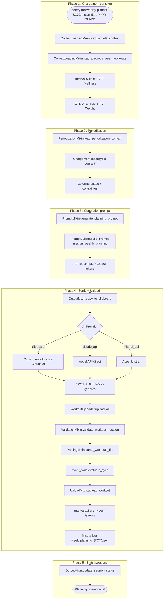
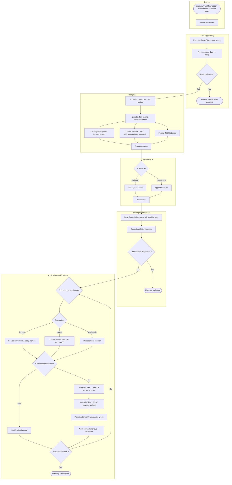
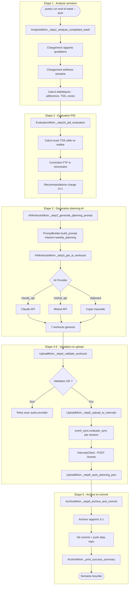
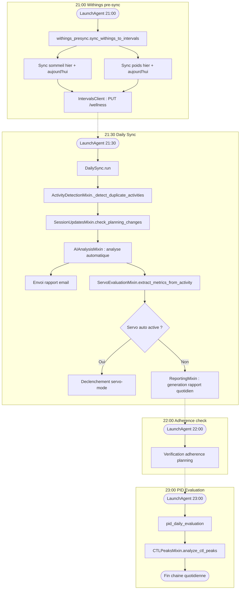

# GRAFCET Workflow Complet - Magma Cycling

**Date** : Mars 2026
**Version** : 2.0
**Architecture** : Post-refactoring Phase 3 (facades + mixins)

---

## 1. Vue d'ensemble systeme

Trois chemins principaux (planning, analyse, servo) convergent vers les facades et leurs mixins.

```mermaid
graph TB
    Start([Utilisateur]) --> Choice{Type d'operation}

    Choice -->|Planning hebdomadaire| WP[WeeklyPlanner]
    Choice -->|Analyse de seance| WC[WorkflowCoach]
    Choice -->|Modifications planning| SM[WorkflowCoach --servo-mode]
    Choice -->|Fin de semaine| EOW[EndOfWeekWorkflow]
    Choice -->|Synchronisation| DS[DailySync]
    Choice -->|Upload workouts| UW[WorkoutUploader]

    subgraph "Facades"
        WP
        WC
        SM
        EOW
        DS
        UW
    end

    subgraph "Mixins Coach (11)"
        WC --> GapDetectionMixin
        WC --> FeedbackMixin
        WC --> AIAnalysisMixin_C[AIAnalysisMixin]
        WC --> SessionDisplayMixin
        WC --> HistoryMixin
        WC --> GitOpsMixin
        WC --> ReconciliationMixin
        WC --> SpecialSessionsMixin
        WC --> ServoControlMixin
        WC --> IntervalsAPIMixin
        WC --> UIHelpersMixin
    end

    subgraph "Mixins Planner (4)"
        WP --> ContextLoadingMixin_P[ContextLoadingMixin]
        WP --> PeriodizationMixin
        WP --> PromptMixin
        WP --> OutputMixin
    end

    subgraph "Mixins EndOfWeek (5)"
        EOW --> AnalysisMixin
        EOW --> EvaluationMixin
        EOW --> AIWorkoutsMixin
        EOW --> UploadMixin_E[UploadMixin]
        EOW --> ArchiveMixin
    end

    subgraph "Mixins Sync (7)"
        DS --> ActivityDetectionMixin
        DS --> SessionUpdatesMixin
        DS --> ServoEvaluationMixin
        DS --> AIAnalysisMixin_S[AIAnalysisMixin]
        DS --> CTLPeaksMixin
        DS --> ReportingMixin
        DS --> ActivityTracker
    end

    subgraph "Mixins Uploader (3)"
        UW --> ValidationMixin
        UW --> ParsingMixin
        UW --> UploadMixin_U[UploadMixin]
    end

    subgraph "Services transverses"
        CT[PlanningControlTower]
        PB[PromptBuilder - build_prompt]
        ES[EventSync - evaluate_sync]
        IC[IntervalsClient]
        AP[AIProviderFactory]
    end

    WC -.-> CT
    WP -.-> PB
    EOW -.-> CT
    UW -.-> ES
    DS -.-> IC
    EOW -.-> AP
```

---

## 2. Pipeline planning hebdomadaire

---

## 3. Boucle servo-mode

---

## 4. Pipeline end-of-week

---

## 5. Pipeline daily-sync

Chaine automatisee quotidienne via LaunchAgents.

---

## 6. Services transverses

```mermaid
graph TB
    subgraph "Control Tower"
        CT[PlanningControlTower]
        CT --> Read[read_week : lecture seule]
        CT --> Modify[modify_week : context manager]
        Modify --> Backup[Backup automatique]
        Modify --> Audit[Audit JSONL : WHO/WHY/WHEN/WHAT]
        Modify --> Permission[Verification permissions]
    end

    subgraph "Prompt Builder"
        PBuild[prompt_builder.build_prompt]
        PBuild --> Mission{Mission}
        Mission -->|daily_feedback| DailyPrompt[Prompt analyse seance]
        Mission -->|weekly_planning| WeeklyPrompt[Prompt planning hebdo]
        PBuild --> Profile[format_athlete_profile]
        PBuild --> Metrics[load_current_metrics : FTP, CTL, ATL]
        PBuild --> System[base_system.txt + mission file]
    end

    subgraph "Event Sync"
        ESSync[event_sync]
        ESSync --> Eval[evaluate_sync : decision sync]
        ESSync --> Hash[calculate_description_hash]
        ESSync --> Time[compute_start_time]
        Eval --> Decision{SyncDecision}
        Decision --> Create[CREATE : nouveau workout]
        Decision --> Update[UPDATE : workout modifie]
        Decision --> Skip[SKIP : deja a jour]
    end

    subgraph "AI Providers"
        APF[AIProviderFactory]
        APF --> Claude[claude_api]
        APF --> Mistral[mistral_api]
        APF --> OpenAI[openai_api]
        APF --> Ollama[ollama]
        APF --> Clip[clipboard]
    end

    subgraph "Intervals.icu Client"
        IC[IntervalsClient]
        IC --> GetAth[get_athlete]
        IC --> GetAct[get_activities]
        IC --> GetWell[get_wellness]
        IC --> GetEvt[get_events]
        IC --> CreateEvt[create_event]
        IC --> UpdateWell[update_wellness]
    end
```

---

## Conventions

- **Nommage noeuds** : `MixinName.method()` (pas de numeros de ligne)
- **Subgraphs** : par phase fonctionnelle
- **Liens pointilles** : dependances inter-services (non bloquantes)
- **Liens pleins** : flux de donnees principal

---

**Date** : Mars 2026
**Version** : 2.0
