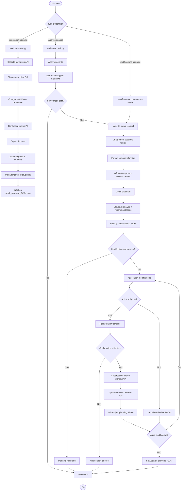

# GRAFCET WORKFLOW COMPLET - Cyclisme Training Logs

**Date**: 2025-12-21
**Mission**: Cartographie complète du workflow de génération et modification de planning

---

## 1. GRAFCET PRINCIPAL - Vue d'ensemble



---

## 2. GRAFCET DÉTAILLÉ - Génération Planning Hebdomadaire

```mermaid
graph TB
    subgraph "PHASE 1: Collecte Données"
        Start([poetry run weekly-planner S072 --start-date 2025-12-16])
        Start --> Init[__init__ lines 47-65]
        Init --> Run[run lines 484-527]
        Run --> Step1[collect_current_metrics lines 67-116]
        Step1 --> API1[GET /api/v1/athlete/iXXXXXX/wellness]
        API1 --> Metrics[CTL, ATL, TSB, HR, HRV, Weight]
        Metrics --> Step2[load_previous_week_bilan lines 118-131]
        Step2 --> ReadBilan[Lecture logs/weekly_reports/S071/bilan_final_S071.md]
        ReadBilan --> Step3[load_context_files lines 133-171]
        Step3 --> LoadRef1[references/project_prompt_v2_1_revised.md]
        Step3 --> LoadRef2[references/cycling_training_concepts.md]
        Step3 --> LoadRef3[references/Documentation_Complète_du_Suivi_v1_5.md]
        Step3 --> LoadRef4[references/protocols/*.md si disponible]
    end

    subgraph "PHASE 2: Construction Prompt"
        LoadRef4 --> Step4[generate_planning_prompt lines 173-473]
        Step4 --> Section1[Contexte Athlète lines 181-210]
        Step4 --> Section2[Période à Planifier lines 211-222]
        Step4 --> Section3[État Actuel metrics + bilan lines 224-256]
        Step4 --> Section4[Concepts Entraînement lines 258-271]
        Step4 --> Section5[Guide Intervals.icu lines 226-245]
        Step4 --> Section6[Mission + Format lines 273-470]

        Section6 --> Constraint1[Format sortie OBLIGATOIRE]
        Section6 --> Constraint2[Convention nommage SSSS-JJ-TYPE-Nom-V001]
        Section6 --> Constraint3[Types entraînement ligne 288-298]
        Section6 --> Constraint4[Règles intensité ligne 307-322]
        Section6 --> Constraint5[Checklist VO2 Max ligne 344-351]
        Section6 --> Constraint6[Validation technique ligne 353-366]

        Section6 --> Output[Prompt complet ~15k-20k tokens]
    end

    subgraph "PHASE 3: Interaction Utilisateur"
        Output --> Step5[copy_to_clipboard lines 475-482]
        Step5 --> Pbcopy[pbcopy via subprocess]
        Pbcopy --> Display[Affichage instructions]
        Display --> UserAction1[Utilisateur ouvre Claude.ai]
        UserAction1 --> UserAction2[Colle prompt Cmd+V]
        UserAction2 --> ClaudeGen[Claude génère 7 WORKOUT blocks]
        ClaudeGen --> UserAction3[Utilisateur copie chaque workout]
        UserAction3 --> UserAction4[Upload manuel Intervals.icu]
    end

    subgraph "PHASE 4: Persistence Planning"
        UserAction4 --> CreateJSON[Création manuelle week_planning_S072.json]
        CreateJSON --> JSONStructure{
            week_id: S072
            start_date: 2025-12-16
            end_date: 2025-12-22
            version: 1
            planned_sessions: []
        }
        JSONStructure --> Session1[Session S072-01-INT-SweetSpot-V001]
        JSONStructure --> Session7[Session S072-07-REC-ReposObligatoire-V001]
        Session7 --> SaveJSON[Sauvegarde data/week_planning/week_planning_S072.json]
    end

    SaveJSON --> End([Fin génération planning])
```

---

## 3. GRAFCET DÉTAILLÉ - Servo Mode (Modifications Planning)

```mermaid
graph TB
    subgraph "ENTRÉE Servo Mode"
        Start([poetry run workflow-coach --servo-mode])
        Start --> Parse[main lines 2392-2410]
        Parse --> Constructor[__init__ line 42-64]
        Constructor --> LoadTemplates[load_workout_templates lines 91-119]
        LoadTemplates --> Template1[recovery_active_30tss.json]
        LoadTemplates --> Template6[sweetspot_short_50tss.json]
        Template6 --> WorkflowRun[run line 2175-2260]
        WorkflowRun --> Step6b[step_6b_servo_control lines 1855-2024]
    end

    subgraph "CHARGEMENT Planning"
        Step6b --> DetectWeek[Détection week_id lines 1878-1887]
        DetectWeek --> LoadSessions[load_remaining_sessions lines 1891-1912]
        LoadSessions --> ReadJSON[Lecture week_planning_S072.json]
        ReadJSON --> FilterFuture[Filtre sessions date >= today]
        FilterFuture --> Display[Affichage sessions restantes]
        Display --> UserPrompt{Demander recommandations AI? line 1917}
    end

    subgraph "GÉNÉRATION Prompt Asservissement"
        UserPrompt -->|Oui| FormatCompact[format_remaining_sessions_compact lines 154-183]
        FormatCompact --> BuildPrompt[Construction prompt lines 1927-1971]

        BuildPrompt --> Header[# ASSERVISSEMENT PLANNING]
        BuildPrompt --> Context[Contexte: planning restant]
        BuildPrompt --> Catalog[Catalogue templates lignes 1932-1946]

        Catalog --> RecGroup[RÉCUPÉRATION: 3 templates]
        Catalog --> EndGroup[ENDURANCE ALLÉGÉE: 2 templates]
        Catalog --> IntGroup[INTENSITÉ RÉDUITE: 1 template]

        BuildPrompt --> Criteria[Critères décision lignes 1948-1956]
        Criteria --> HRV[HRV < -10%]
        Criteria --> RPE[RPE > 8/10]
        Criteria --> Decoupling[Découplage > 7.5%]
        Criteria --> Sleep[Sommeil < 7h]

        BuildPrompt --> JSONFormat[Format JSON lignes 1958-1967]
        JSONFormat --> PromptReady[Prompt complet]
    end

    subgraph "INTERACTION Utilisateur"
        PromptReady --> Clipboard[copy_to_clipboard lines 1975-1979]
        Clipboard --> Instructions[Affichage instructions lignes 1981-1990]
        Instructions --> WaitUser[Attente réponse utilisateur ligne 1991]
        WaitUser --> Pbpaste[pbpaste récupération ligne 2000-2006]
        Pbpaste --> AIResponse[Réponse AI copiée]
    end

    subgraph "PARSING Modifications"
        AIResponse --> ParseMods[parse_ai_modifications lines 185-211]
        ParseMods --> RegexJSON[Regex extraction JSON lines 197-200]
        RegexJSON --> JSONParse[json.loads lines 206-208]
        JSONParse --> CheckEmpty{Liste vide? line 2015}
    end

    subgraph "APPLICATION Modifications"
        CheckEmpty -->|Non| ApplyLoop[apply_planning_modifications lines 484-509]
        ApplyLoop --> ForEachMod{Pour chaque modification}

        ForEachMod --> CheckAction{action type? line 499}
        CheckAction -->|lighten| ApplyLighten[_apply_lighten lines 414-482]
        CheckAction -->|cancel| TODO1[TODO: Implémenter]
        CheckAction -->|reschedule| TODO2[TODO: Implémenter]

        ApplyLighten --> ValidateTemplate[Validation template lignes 421-425]
        ValidateTemplate --> DisplayMod[Affichage modification lignes 429-432]
        DisplayMod --> UserConfirm{Confirmation utilisateur ligne 435-438}

        UserConfirm -->|Oui| ExtractDay[_extract_day_number lignes 213-237]
        ExtractDay --> GenCode[Génération workout_code lignes 440-445]
        GenCode --> GetOldID[_get_workout_id_intervals lignes 239-273]
        GetOldID --> DeleteOld[_delete_workout_intervals lignes 275-305]
        DeleteOld --> UploadNew[_upload_workout_intervals lignes 307-346]
        UploadNew --> UpdateJSON[_update_planning_json lignes 348-412]
        UpdateJSON --> NextMod{Autre modification?}

        UserConfirm -->|Non| SkipMod[Modification ignorée]
        SkipMod --> NextMod

        NextMod -->|Oui| ForEachMod
        NextMod -->|Non| Complete[Modifications appliquées]
    end

    CheckEmpty -->|Oui| NoChange[Planning maintenu ligne 2015-2018]
    Complete --> End([Fin servo mode])
    NoChange --> End
```



---

## 4. CHAÎNE COMPLÈTE - Prompt → AI → Validation → Upload API

```mermaid
graph LR
    subgraph "1. PROMPT"
        P1[Template Catalog]
        P2[Planning Context]
        P3[Decision Criteria]
        P4[JSON Format Spec]
        P1 --> Prompt[Complete Prompt]
        P2 --> Prompt
        P3 --> Prompt
        P4 --> Prompt
    end

    subgraph "2. AI"
        Prompt --> Claude[Claude.ai]
        Claude --> Analysis[Natural Language Analysis]
        Claude --> JSON[JSON Block]
        JSON --> ModArray["modifications: []"]
    end

    subgraph "3. PARSE"
        ModArray --> Regex[Regex Extraction]
        Regex --> Deserialize[json.loads]
        Deserialize --> ModList[List of Dicts]
    end

    subgraph "4. VALIDATE"
        ModList --> CheckTemplate{Template exists?}
        CheckTemplate -->|No| Error[Erreur template]
        CheckTemplate -->|Yes| LoadTemplate[Load Template JSON]
        LoadTemplate --> CheckFields{Required fields?}
        CheckFields --> ValidateType{type in VALID_TYPES?}
        ValidateType --> UserConfirm{User confirmation?}
    end

    subgraph "5. TRANSFORM"
        UserConfirm -->|Yes| ExtractDay[Extract day_num]
        ExtractDay --> FormatCode[Format workout_code]
        FormatCode --> BuildEvent[Build event dict]
        BuildEvent --> EventStruct{
            category: WORKOUT
            name: code
            workout_doc: intervals_icu_format
            start_date_local: dateT06:00:00
        }
    end

    subgraph "6. UPLOAD API"
        EventStruct --> DeleteOld[DELETE old workout]
        DeleteOld --> CreateNew[POST /api/v1/athlete/ID/events]
        CreateNew --> APIResponse{Success?}
        APIResponse -->|Yes| UpdateJSON[Update planning JSON]
        APIResponse -->|No| Rollback[Error no rollback]
    end

    UpdateJSON --> History[Add history entry]
    History --> IncrementVersion[Increment version]
    IncrementVersion --> SaveFile[Save JSON file]
```



---

## 5. FICHIERS IMPLIQUÉS - Index Complet

### 5.1 Scripts Principaux

| Fichier | Lignes | Responsabilité | Points Clés |
|---------|--------|----------------|-------------|
| **cyclisme_training_logs/weekly_planner.py** | 592 | Génération planning hebdomadaire | Lines 173-473: generate_planning_prompt()<br>Lines 226-245: Règles format Intervals.icu<br>Lines 288-298: VALID_TYPES<br>Lines 484-527: run() |
| **cyclisme_training_logs/workflow_coach.py** | 2370 | Orchestration analyse + servo mode | Lines 1855-2024: step_6b_servo_control()<br>Lines 414-482: _apply_lighten()<br>Lines 307-346: _upload_workout_intervals()<br>Lines 185-211: parse_ai_modifications() |
| **cyclisme_training_logs/prepare_analysis.py** | 1200+ | API Intervals.icu | Lines 108-146: create_event()<br>Lines 148-171: get_events()<br>Lines 173-195: get_activities() |
| **cyclisme_training_logs/rest_and_cancellations.py** | 589 | Validation planning | Line 41: VALID_STATUSES<br>Line 42: VALID_TYPES<br>Lines 49-86: load_week_planning()<br>Lines 88-132: validate_week_planning() |

### 5.2 Données et Templates

| Fichier | Format | Usage |
|---------|--------|-------|
| **data/workout_templates/*.json** | JSON | 6 templates de remplacement servo mode |
| **data/week_planning/week_planning_SXXX.json** | JSON | Planning hebdomadaire avec statuts |
| **references/project_prompt_v2_1_revised.md** | Markdown | Contexte athlète (FTP, objectifs) |
| **references/cycling_training_concepts.md** | Markdown | Zones Z1-Z7, TSS/IF/NP |
| **logs/workout-templates.md** | Markdown | Exemples formats validés |
| **logs/weekly_reports/SXXX/bilan_final_SXXX.md** | Markdown | Bilan semaine précédente |

### 5.3 Configuration

| Fichier | Usage |
|---------|-------|
| **~/.intervals_config.json** | Credentials API (athlete_id, api_key) |
| **pyproject.toml** | CLI commands registration (lines 51-57) |
| **.workflow_state.json** | État workflow (dernière activité analysée) |

---

## 6. POINTS CRITIQUES - Injection Corrections

### 6.1 BUG CRITIQUE: "workout_doc" vs "description"

**Localisation**: `workflow_coach.py` ligne 336

**Code Actuel**:
```python
event = {
    "category": "WORKOUT",
    "start_date_local": f"{date}T06:00:00",
    "name": code,
    "description": code,
    "workout_doc": structure  # ⚠️ PROBLÈME ICI
}
```

**Documentation API** (`prepare_analysis.py` ligne 116):
```python
Args:
    event_data: Dictionnaire contenant :
        - category: "WORKOUT"
        - name: Nom du workout
        - description: Contenu au format Intervals.icu  # ⬅️ Devrait être ici
        - start_date_local: Date au format YYYY-MM-DD
```

**Correction P0 #6**: Changer `workout_doc` en `description`
```python
event = {
    "category": "WORKOUT",
    "start_date_local": f"{date}T06:00:00",
    "name": code,
    "description": structure,  # ✅ CORRECTION
}
```

**Impact**: Upload workouts échoue ou format mal interprété par Intervals.icu

---

### 6.2 BUG FORMAT: Blocs Répétés "Test capacité 3x"

**Symptôme**: Génération de "Test capacité 3x" au lieu de "3x" seul

**Format Attendu** (weekly_planner.py ligne 239):
```
Main set 3x
- 10m 90% 92rpm
- 4m 62% 85rpm
```

**Format Incorrect Produit**:
```
Test capacité 3x
- 10m 90% 92rpm
- 4m 62% 85rpm
```

**Analyse Root Cause**:
- Templates JSON contiennent format correct (vérification faite)
- Prompt `weekly_planner.py` ligne 226-245 documente correctement
- Problème probable: Claude.ai génère label + "3x" ensemble

**Point d'Injection P0 #7**: Ajouter validation post-génération

**Localisation**: Après `generate_planning_prompt()`, avant copie clipboard

**Nouveau code à ajouter** (ligne 474 dans `weekly_planner.py`):
```python
def validate_intervals_format(self, prompt: str) -> str:
    """
    Valider et corriger format blocs répétés

    Corrige: "Test capacité 3x" → "3x"
    Corrige: "Main set Test 3x" → "Main set 3x"
    """
    import re

    # Pattern: Trouve lignes avec texte + "3x" ou "2x" etc
    pattern = r'^(.*?)\s+(\d+x)\s*$'

    lines = prompt.split('\n')
    corrected = []

    for line in lines:
        match = re.match(pattern, line)
        if match:
            prefix = match.group(1).strip()
            repetition = match.group(2)

            # Si prefix contient "Main set", "Warmup", "Cooldown" → OK
            # Sinon, ne garder que le répétition marker
            valid_prefixes = ['Main set', 'Warmup', 'Cooldown', 'Block']

            if any(vp in prefix for vp in valid_prefixes):
                corrected.append(f"{prefix} {repetition}")
            else:
                # Supprimer label parasite
                corrected.append(repetition)
        else:
            corrected.append(line)

    return '\n'.join(corrected)
```

**Intégration** (ligne 469):
```python
prompt = self.generate_planning_prompt()
prompt = self.validate_intervals_format(prompt)  # ⬅️ NOUVELLE LIGNE
self.copy_to_clipboard(prompt)
```

---

### 6.3 Validation VALID_TYPES

**Localisation**: `rest_and_cancellations.py` ligne 42

**Valeur Actuelle** (corrigée Phase 2):
```python
VALID_TYPES = ['END', 'INT', 'FTP', 'SPR', 'CLM', 'REC', 'FOR', 'CAD', 'TEC', 'MIX', 'PDC', 'TST']
```

**Point d'injection validation**: `validate_week_planning()` ligne 88-132

**Code de validation** (lignes 110-116):
```python
for session in week_planning['planned_sessions']:
    # Validation type
    if session['type'] not in VALID_TYPES:
        errors.append(
            f"Session {session['session_id']} : type '{session['type']}' invalide. "
            f"Types valides : {', '.join(VALID_TYPES)}"
        )
```

**Status**: ✅ Déjà implémenté et corrigé

---

### 6.4 Validation Format Intervals.icu dans Templates

**Point d'injection**: `load_workout_templates()` ligne 91-119

**Validation à ajouter** (après ligne 107):
```python
def validate_template_format(self, template: dict) -> bool:
    """
    Valider format Intervals.icu dans template

    Vérifie:
    - Pas de markdown (**, ###, etc)
    - Sections valides (Warmup, Main set, Cooldown)
    - Format répétitions "Nx" seul
    """
    format_str = template.get('intervals_icu_format', '')

    # Check 1: Pas de markdown
    if '**' in format_str or '###' in format_str:
        print(f"⚠️  Template {template['id']}: contient markdown")
        return False

    # Check 2: Répétitions format correct
    import re
    lines = format_str.split('\n')
    for line in lines:
        # Détecter "texte 3x" (incorrect)
        if re.search(r'[a-zA-Z]\s+\d+x\s*$', line):
            # Vérifier si c'est "Main set 3x" (OK) ou "Test 3x" (NOK)
            if not any(prefix in line for prefix in ['Main set', 'Block']):
                print(f"⚠️  Template {template['id']}: format répétition incorrect: {line}")
                return False

    return True
```

**Intégration** (ligne 109):
```python
with open(template_path, 'r', encoding='utf-8') as f:
    template = json.load(f)

    # NOUVELLE VALIDATION
    if not self.validate_template_format(template):
        print(f"❌ Template {template_path.name} : format invalide")
        continue

    self.workout_templates[template['id']] = template
```

---

## 7. RÉSUMÉ - Points d'Injection P0 #6 et #7

### P0 #6: Correction champ API "workout_doc" → "description"

| Composant | Fichier | Ligne | Action |
|-----------|---------|-------|--------|
| Upload workout | workflow_coach.py | 336 | Renommer `"workout_doc"` en `"description"` |
| Documentation API | prepare_analysis.py | 116 | Vérifier cohérence docs |

**Priorité**: P0 - CRITIQUE
**Effort**: 2 minutes
**Test**: Upload workout via servo mode

---

### P0 #7: Validation format blocs répétés

| Composant | Fichier | Ligne | Action |
|-----------|---------|-------|--------|
| Post-generation validation | weekly_planner.py | 474 | Ajouter `validate_intervals_format()` |
| Template loading validation | workflow_coach.py | 109 | Ajouter `validate_template_format()` |
| Prompt clarification | weekly_planner.py | 239-245 | Renforcer instruction "3x SEUL" |

**Priorité**: P0 - CRITIQUE
**Effort**: 30 minutes
**Test**: Générer planning + vérifier format répétitions

---

## 8. FLUX DONNÉES - Schéma Complet

```
┌──────────────────────────────────────────────────────────────────┐
│ GÉNÉRATION PLANNING (weekly-planner.py)                         │
├──────────────────────────────────────────────────────────────────┤
│ Inputs:                                                           │
│   • Metrics API (CTL, ATL, TSB, HRV)                             │
│   • Bilan S-1 (logs/weekly_reports/S071/bilan_final_S071.md)    │
│   • Références (project_prompt, concepts, protocols)             │
│                                                                   │
│ Processing:                                                       │
│   • Prompt construction (~15-20k tokens)                         │
│   • Format Intervals.icu specification                           │
│   • Naming convention SSSS-JJ-TYPE-Name-V001                    │
│                                                                   │
│ Outputs:                                                          │
│   • Prompt copié clipboard                                       │
│   • User paste to Claude.ai                                      │
│   • Claude generates 7 WORKOUT blocks                            │
│   • User uploads to Intervals.icu manually                       │
│   • Creation week_planning_SXXX.json                             │
└──────────────────────────────────────────────────────────────────┘
                              ↓
┌──────────────────────────────────────────────────────────────────┐
│ ANALYSE SÉANCE (workflow-coach.py)                              │
├──────────────────────────────────────────────────────────────────┤
│ Inputs:                                                           │
│   • Activity data from Intervals.icu API                         │
│   • Week planning JSON                                           │
│   • Activity streams (power, HR, cadence)                        │
│                                                                   │
│ Processing:                                                       │
│   • Analysis metrics (NP, IF, VI, TSS)                           │
│   • Cardiac decoupling calculation                               │
│   • Report generation (markdown)                                 │
│                                                                   │
│ Outputs:                                                          │
│   • Analysis markdown report                                     │
│   • Git commit                                                   │
│   • Workflow state update                                        │
└──────────────────────────────────────────────────────────────────┘
                              ↓ (if --servo-mode)
┌──────────────────────────────────────────────────────────────────┐
│ MODIFICATIONS PLANNING (servo mode)                             │
├──────────────────────────────────────────────────────────────────┤
│ Inputs:                                                           │
│   • Remaining sessions from week_planning_SXXX.json              │
│   • Workout templates catalog (6 templates)                      │
│   • Activity analysis (fatigue signals)                          │
│                                                                   │
│ Processing:                                                       │
│   • AI prompt with planning context                              │
│   • Parse AI modifications (JSON extraction)                     │
│   • User confirmation per modification                           │
│   • Delete old workout from API                                  │
│   • Upload new workout to API                                    │
│   • Update planning JSON with history                            │
│                                                                   │
│ Outputs:                                                          │
│   • Modified week_planning_SXXX.json (version++)                 │
│   • Updated workouts on Intervals.icu                            │
│   • History entries in JSON                                      │
└──────────────────────────────────────────────────────────────────┘
```

---

## 9. COMMANDES CLI - Référence Rapide

```bash
# Génération planning hebdomadaire
poetry run weekly-planner S072 --start-date 2025-12-16

# Analyse séance simple
poetry run workflow-coach

# Analyse séance avec servo mode
poetry run workflow-coach --servo-mode --week-id S072

# Réconciliation batch
poetry run workflow-coach --reconcile --week-id S072

# Analyse activité spécifique
poetry run workflow-coach --activity-id i107779437

# Mode skip (tests)
poetry run workflow-coach --skip-feedback --skip-git
```

---

## 10. PROCHAINES ÉTAPES - Corrections P0 #6 et #7

### Étape 1: Correction champ API (P0 #6)
```bash
# 1. Modifier workflow_coach.py ligne 336
# 2. Tester upload workout
poetry run workflow-coach --servo-mode --week-id S072
```

### Étape 2: Validation format répétitions (P0 #7)
```bash
# 1. Ajouter validate_intervals_format() dans weekly_planner.py
# 2. Ajouter validate_template_format() dans workflow_coach.py
# 3. Tester génération planning
poetry run weekly-planner S073 --start-date 2025-12-23
```

### Étape 3: Tests Validation
```bash
# Créer tests/test_intervals_format.py
poetry run pytest tests/test_intervals_format.py -v
```

---

**Status**: 📋 GRAFCET COMPLET
**Prêt pour**: Implémentation corrections P0 #6 et #7
