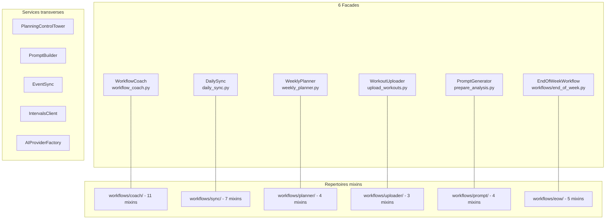

# Workflows - Hub d'Onboarding

**Version** : 2.0
**Date** : Mars 2026

---

## Quick Start - Sequence hebdomadaire

```bash
# Lundi matin : cycle hebdomadaire
wa --week-id S084                              # Analyse semaine passee
wp --week-id S085 --start-date 2026-03-16      # Planning semaine courante
wu --week-id S085                              # Upload workouts Intervals.icu

# Quotidien : apres chaque seance
train                                          # Analyse standard
trains --week-id S085                          # Avec asservissement (Mer/Ven)

# Dimanche soir
trainr --week-id S085                          # Reconciliation si necessaire
```

---

## Architecture



---

## Documentation

| Document | Audience | Quand le lire |
|----------|----------|---------------|
| [DAILY_WORKFLOW.md](DAILY_WORKFLOW.md) | Utilisateur | Routine quotidienne : quel workflow utiliser apres chaque seance |
| [WORKFLOW_COMPLET.md](WORKFLOW_COMPLET.md) | Developpeur | Reference technique : architecture WorkflowCoach, 11 mixins, providers AI |
| [GRAFCET_WORKFLOW_COMPLET.md](GRAFCET_WORKFLOW_COMPLET.md) | Developpeur | 6 diagrammes Mermaid : vues systeme, pipelines, services transverses |
| [UML_ACTIVITY_DIAGRAMS.md](UML_ACTIVITY_DIAGRAMS.md) | Developpeur | 4 diagrammes de detail : flux analyse, upload, servo, end-of-week |
| [../MCP_INTEGRATION.md](../MCP_INTEGRATION.md) | Developpeur | Integration MCP : 48 tools exposes a Claude Desktop |

---

## Commandes CLI principales

| Alias | Commande | Description |
|-------|----------|-------------|
| `train` | `poetry run workflow-coach` | Analyse standard post-seance |
| `trains` | `poetry run workflow-coach --servo-mode` | Analyse + asservissement planning |
| `train-fast` | `poetry run workflow-coach --skip-feedback --skip-git` | Analyse rapide sans feedback |
| `trainr` | `poetry run workflow-coach --reconcile` | Reconciliation seances manquees |
| `wa` | `poetry run weekly-analysis` | Analyse hebdomadaire |
| `wp` | `poetry run weekly-planner` | Generation planning hebdomadaire |
| `wu` | `poetry run upload-workouts` | Upload workouts vers Intervals.icu |
| `check` | `poetry run planned-checker` | Verification planning semaine |
| `ds` | `poetry run daily-sync` | Synchronisation quotidienne |
| `eow` | `poetry run end-of-week` | Workflow fin de semaine |

---

## Automation LaunchAgents

### Chaine quotidienne
| Heure | Service | Description |
|-------|---------|-------------|
| 21:00 | `withings-presync` | Sync sante Withings vers Intervals.icu |
| 21:30 | `daily-sync` | Sync activites + analyse AI + servo auto |
| 22:00 | `adherence-check` | Verification adherence planning |
| 23:00 | `pid-evaluation` | Evaluation PID quotidienne |

### Dimanche
| Heure | Service | Description |
|-------|---------|-------------|
| 20:00 | `end-of-week` | Boucle semaine + planning S+1 automatique |

---

## Liens utiles

- [AUTOMATION.md](../AUTOMATION.md) : Configuration LaunchAgents
- [COMMANDS.md](../COMMANDS.md) : Reference complete des commandes CLI
- [ARCHITECTURE.md](../ARCHITECTURE.md) : Architecture technique du projet
- [MCP_INTEGRATION.md](../MCP_INTEGRATION.md) : Integration MCP (48 tools)
- [CONTROL_TOWER.md](../CONTROL_TOWER.md) : Systeme de controle planning

---

**Version** : 2.0
**Date** : Mars 2026
