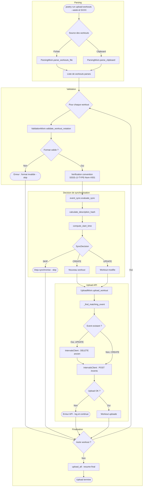
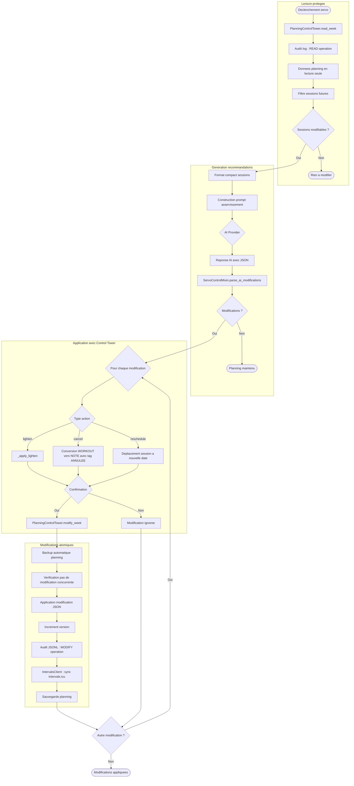
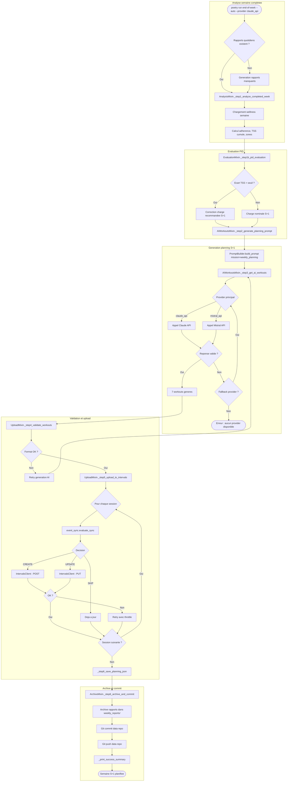

# Diagrammes d'activite - Magma Cycling

**Date** : Mars 2026
**Version** : 2.0
**Architecture** : Post-refactoring Phase 3 (facades + mixins)

---

## 1. Flux analyse de seance (WorkflowCoach)

Pipeline complet depuis la detection d'activites jusqu'au commit git.

```mermaid
graph TB
    Start([poetry run workflow-coach])

    subgraph "Detection"
        Start --> Gap[GapDetectionMixin.step_1b_detect_all_gaps]
        Gap --> DetectAct[_detect_unanalyzed_activities]
        DetectAct --> DetectSkip[_detect_skipped_sessions]
        DetectSkip --> DetectRest[_detect_rest_and_cancelled_sessions]
        DetectRest --> Menu[_prompt_user_choice]
        Menu --> Choice{Nombre activites}
        Choice -->|0| NoActivity([Aucune activite a analyser])
        Choice -->|1| Single[Analyse directe]
        Choice -->|2+| Batch[Menu : derniere / choisir / batch]
    end

    subgraph "Feedback"
        Single --> FB[FeedbackMixin.step_2_collect_feedback]
        Batch --> FB
        FB --> Validate[_validate_feedback_collection]
        Validate --> Prepare[_prepare_feedback_context]
        Prepare --> Execute[_execute_feedback_collection]
        Execute --> FBResult{Feedback collecte ?}
        FBResult -->|Non, skip| Analysis
        FBResult -->|Oui| FBData[RPE, sensations, sommeil]
        FBData --> Analysis
    end

    subgraph "Analyse AI"
        Analysis[AIAnalysisMixin.step_3_prepare_analysis]
        Analysis --> DetectWeek[_detect_week_id]
        DetectWeek --> CheckPlan[_check_planning_available]
        CheckPlan --> BuildPrompt[PromptBuilder.build_prompt mission=daily_feedback]
        BuildPrompt --> Provider{AI Provider}
        Provider -->|clipboard| Clipboard[Copie presse-papier]
        Provider -->|claude_api| APICall[Appel API direct]
        Provider -->|mistral_api| MistralCall[Appel Mistral]
        Clipboard --> Display
        APICall --> Display
        MistralCall --> Display
    end

    subgraph "Affichage et validation"
        Display[SessionDisplayMixin.step_4_paste_prompt]
        Display --> Show[step_4b_display_analysis]
        Show --> Validate2[step_5_validate_analysis]
        Validate2 --> Valid{Analyse valide ?}
        Valid -->|Non| Retry([Corriger et relancer])
        Valid -->|Oui| Extract[_extract_metrics_from_analysis]
        Extract --> PostAPI[_post_analysis_to_intervals]
    end

    subgraph "Insertion historique"
        PostAPI --> Insert[HistoryMixin.step_6_insert_analysis]
        Insert --> Preview[_preview_markdowns]
        Preview --> DetectType[_detect_session_type_from_markdown]
        DetectType --> InsertHistory[_insert_to_history]
        InsertHistory --> Export[_export_markdowns]
    end

    subgraph "Git"
        Export --> Git[GitOpsMixin.step_7_git_commit]
        Git --> Commit[_optional_git_commit]
        Commit --> End([Analyse terminee])
    end

    subgraph "Erreurs"
        Analysis -->|API indisponible| ErrAPI([Erreur : verifier credentials])
        Insert -->|Doublon detecte| ErrDup([Erreur : analyse deja inseree])
    end
```

---

## 2. Flux upload workouts (WorkoutUploader)

Pipeline depuis le parsing du fichier workouts jusqu'a l'upload API.



---

## 3. Boucle servo-control

Control Tower comme gardien des modifications planning.



---

## 4. Pipeline end-of-week autonome

Workflow autonome dimanche soir avec decisions et fallbacks.



---

## Conventions

- **Nommage noeuds** : `MixinName.method()` ou `module.function()`
- **Subgraphs** : par phase fonctionnelle
- **Decisions** : losanges avec conditions explicites
- **Erreurs** : noeuds stadium (arrondi) avec prefix "Erreur"
- **Pas de numeros de ligne** : references par module et methode uniquement

---

**Date** : Mars 2026
**Version** : 2.0
